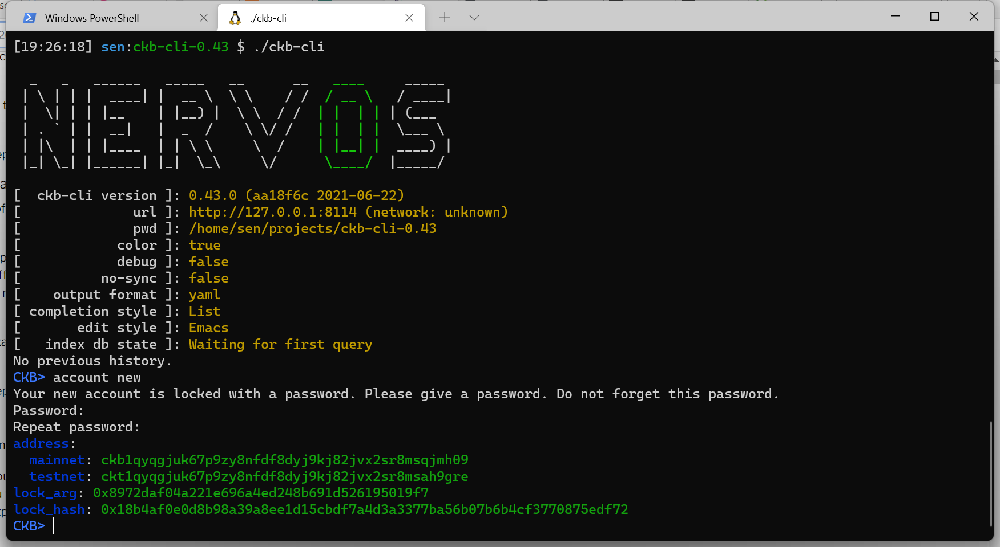
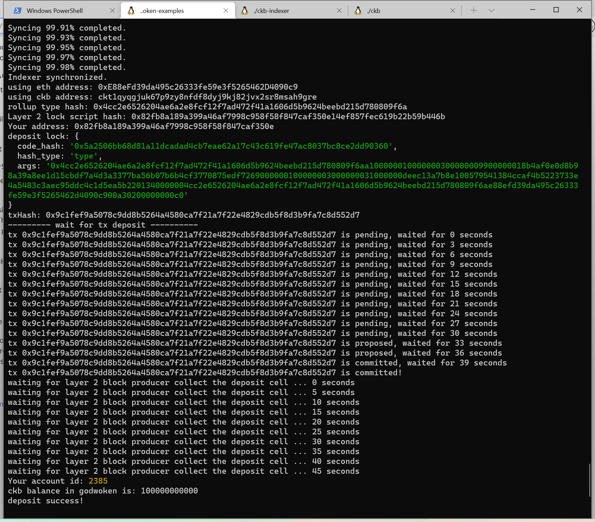

1. A screenshot of the accounts you created (account list) in ckb-cli.

2. A link to the Layer 1 address you funded on the Testnet Explorer.

[funded address](https://explorer.nervos.org/aggron/transaction/0x177a1b85f12ba4d6f6f665f14999226d61252e29fdd810132155eef9f75103f8)

3. A screenshot of the console output immediately after you have successfully submitted a deposit to Layer 2.

