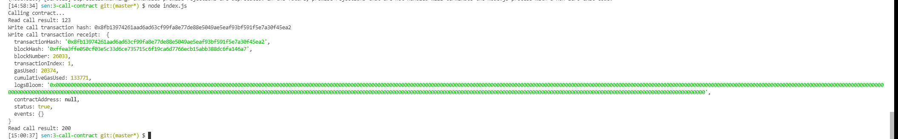

1. A screenshot of the console output immediately after you have successfully issued a smart contract call.

2. The transaction hash from the console output (in text format).

0x8fb13974261aad6ad63cf99fa8e77de88e5049ae5eaf93bf591f5e7a30f45ea2

3. The contract address that you called (in text format).

0x6aD8aFCdfeaAcdc4D03D18606D6FcD20F08eEc70

4. The ABI for contract you made a call on (in text format).

[
    {
      "inputs": [],
      "stateMutability": "payable",
      "type": "constructor"
    },
    {
      "inputs": [
        {
          "internalType": "uint256",
          "name": "x",
          "type": "uint256"
        }
      ],
      "name": "set",
      "outputs": [],
      "stateMutability": "payable",
      "type": "function"
    },
    {
      "inputs": [],
      "name": "get",
      "outputs": [
        {
          "internalType": "uint256",
          "name": "",
          "type": "uint256"
        }
      ],
      "stateMutability": "view",
      "type": "function"
    }
  ]