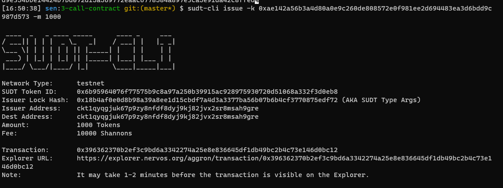
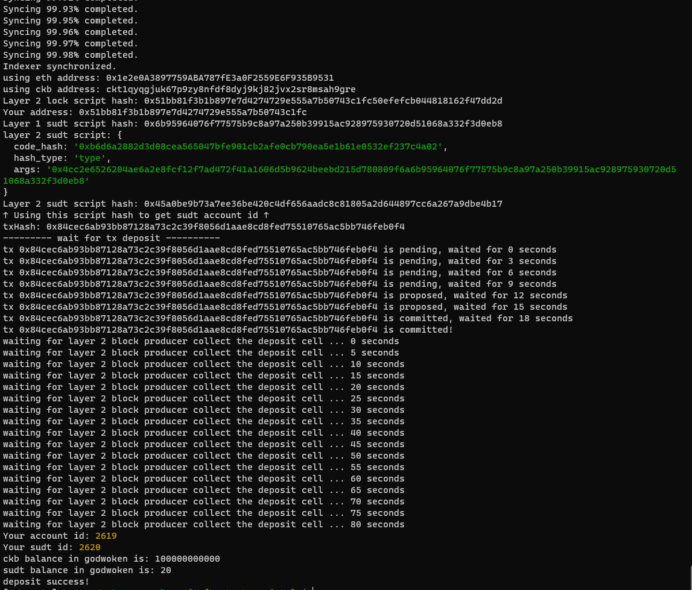

1. A link to the Layer 1 address you funded on the Testnet Explorer.
[funded address](https://explorer.nervos.org/aggron/transaction/0x177a1b85f12ba4d6f6f665f14999226d61252e29fdd810132155eef9f75103f8)

2. A screenshot of the console output immediately after using sudt-cli to create your SUDT tokens on Layer 1.

3. A link to the transaction ID created by sudt-cli on the Testnet Explorer.

[transaction link](https://explorer.nervos.org/aggron/transaction/0x396362370b2ef3c9bd6a3342274a25e8e836645df1db49bc2b4c73e146d0bc12)

4. A screenshot of the console output immediately after you have successfully submitted a deposit to Layer 2 using the account-cli tool.

5. The SUDT ID from the console output after executing the deposit script (in text format).

2620

