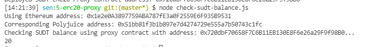

1. A screenshot of the console output immediately after deploying smart contract.

2. The address of the ERC20 Proxy Contract you deployed (in text format).

0x720dbF70658F7C6B11EB130E8F6e26a29F9f98B0

3. A screenshot of the console output immediately after checking your SUDT balance.

4. The Ethereum address that was checked (in text format).

0x1e2e0A3897759ABA787fE3a0F2559E6F935B9531
